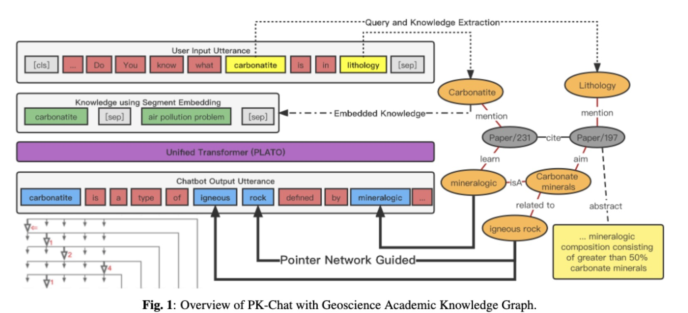

# PK-Chat
**PK-Chat: Pointer Network Guided Knowledge Driven Generative Dialogue Model**
[paper link](https://www.aclweb.org/anthology/2020.acl-main.9.pdf)

 This is the PK-chat models codes.

## Requirements
```
- python >= 3.6
- paddlepaddle == 1.6.1
- numpy
- nltk
- tqdm
- visualdl >= 1.3.0 (optional)
- regex
```
Recommend you install to python packages by command: `pip install -r requirement.txt`

## Pre-trained dialogue generation model
You can see the PK-chat Dialog model from there:
* PK-chat model, uncased [model](path: https://pan.baidu.com/s/1bNzGnnRPMfT4jkD_UsNSYg?pwd=pa7h): 12-layers, 768-hidden, 12-heads, 132M parameters

```bash
mv /path/to/model.tar.gz .
tar xzf model.tar.gz
```

## Fine-tuning
We also provide instructions to fine-tune PK-chat model on different conversation datasets (chit-chat, knowledge grounded dialogues and conversational question answering).

### Data preparation
Download data from the [link](https://baidu-nlp.bj.bcebos.com/PLATO/data.tar.gz).
The tar file contains three processed datasets: `DailyDialog`, `PersonaChat` and `DSTC7_AVSD`.
```bash
mv /path/to/data.tar.gz .
tar xzf data.tar.gz
```

### Data format
Our model supports two kinds of data formats for dialogue context: `multi` and `multi_knowledge`.
* `multi`: multi-turn dialogue context.
```txt
u_1 __eou__ u_2 __eou__ ... u_n \t r
```
* `multi_knowledge`: multi-turn dialogue context with background knowledges.
```txt
k_1 __eou__ k_2 __eou__ ... k_m \t u_1 __eou__ u_2 __eou__ ... u_n \t r
```

If you want to use this model on other datasets, you can process your data accordingly.

### Train
Fine-tuning the pre-trained model on different `${DATASET}`.
```bash
# DailyDialog / PersonaChat / DSTC7_AVSD / ACE_Dialog_topic
DATASET=ACE_Dialog_topic
sh scripts/${DATASET}/train.sh
```
After training, you can find the output folder `outputs/${DATASET}` (by default). It contatins `best.model` (best results on validation dataset), `hparams.json` (hyper-parameters of training script) and `trainer.log` (training log).


Fine-tuning the pre-trained model on multiple GPUs.

Note: You need to install NCCL library and set up the environment variable `LD_LIBRARY` properly.
```bash
sh scripts/ACE_Dialog_topic/multi_gpu_train.sh
```

#### Recommended settings

For the fine-tuning of our pre-trained model, it usually requires about 10 epochs to reach convergence with learning rate = 1e-5 and about 2-3 epochs to reach convergence with learning rate = 5e-5.

GPU Memory | batch size | max len
------|------|------
16G | 6 | 256
32G | 12 | 256

### Infer
Running inference on test dataset.
```bash
# DailyDialog / PersonaChat / DSTC7_AVSD / ACE_Dialog_topic
DATASET=ACE_Dialog_topic
sh scripts/${DATASET}/infer.sh

```
After inference, you can find the output foler `outputs/${DATASET}.infer` (by default). It contains `infer_0.result.json` (the inference result), `hparams.json` (hyper-parameters of inference scipt) and `trainer.log` (inference log).

If you want to use top-k sampling (beam search by default), you can follow the example script:
```bash
sh scripts/DailyDialog/topk_infer.sh
```

## Pipline:


## Result


## Citation
If you find PK-Chat useful in your work, please cite the following paper:
```
@article{PK2023,
  title={PK-CHAT: POINTER NETWORK GUIDED KNOWLEDGE DRIVEN GENERATIVE DIALOGUE MODEL},
  author={Cheng Deng and Bo Tong and Luoyi Fu and Jiaxin Ding and Dexing Cao and Xinbing Wang and Chenghu Zhou},
  journal={ArXiv},
    year={2023},
}
```
 

## Contact information
For help or issues using PK-chat, please submit a GitHub issue.

For personal communication related to PK-chat, please contact Bo Tong (`bool_tbb@alumin.sjtu.edu.cn`), or Cheng Deng (`davendw@sjtu.edu.cn`).
